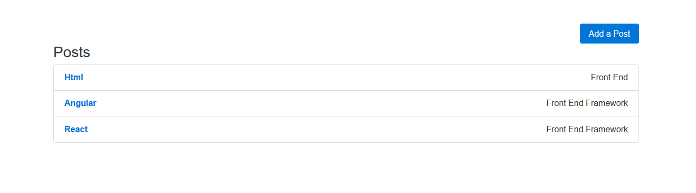

# React-Redux-BlogPost

#### It's a simple React-Redux project

1. Blog List
2. Add a new blog
3. View the selected blog detail
4. Delete a blog

#### Familiar with Git?
Checkout this repo, install dependencies, then start the gulp process with the following:

```
> git clone https://github.com/y394898139/React-Redux-BlogPost.git
> cd React-Redux-BlogPost
> npm install
> npm start
```

#### Or you can go to my heroku page

Link: https://ancient-headland-90014.herokuapp.com/

#### Screenshots of the pages


